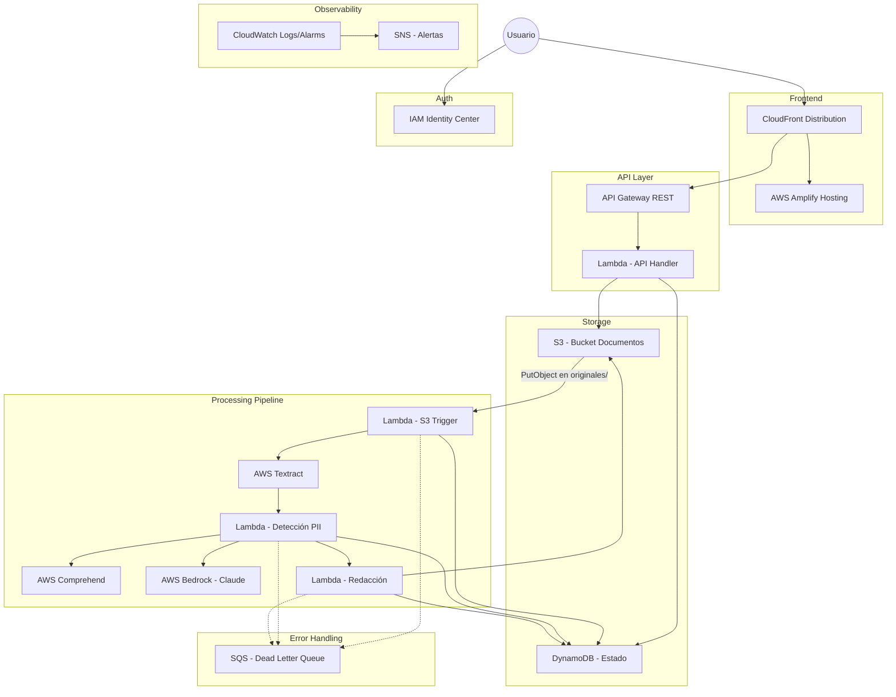
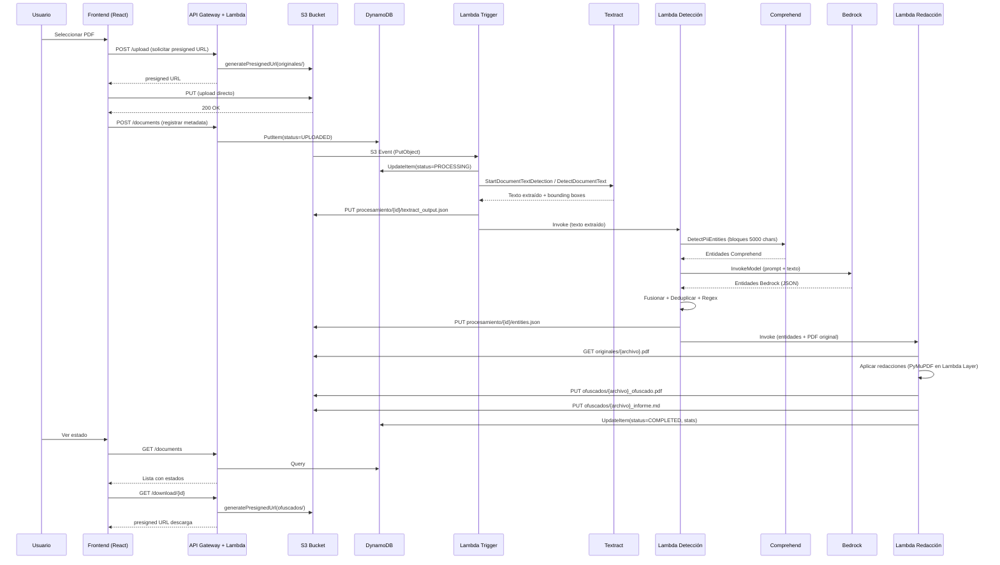

# Design Document: DataMask AWS — PDF Redaction Pipeline

## Overview

DataMask AWS reconstruye la aplicación local de ofuscación de datos sensibles como una solución cloud-native serverless sobre AWS. La arquitectura reemplaza los componentes locales (Ollama/spaCy para NER, PyMuPDF para procesamiento PDF, sistema de archivos local para almacenamiento) por servicios gestionados de AWS (Textract, Comprehend, Bedrock, S3, Lambda).

El sistema sigue un patrón event-driven: cuando un usuario sube un PDF al bucket S3, un evento activa automáticamente un pipeline de procesamiento que extrae texto (Textract), detecta PII (Comprehend + Bedrock), y genera el documento ofuscado. El estado se persiste en DynamoDB y el frontend React — hosteado en AWS Amplify (mismo servicio utilizado en la app ANSES) — consulta vía API Gateway.

### Decisiones Arquitectónicas Clave

| Decisión | Justificación |
|----------|---------------|
| Amplify Hosting (frontend) + CloudFront | Amplify para CI/CD y hosting (como app ANSES); CloudFront delante para control de headers, WAF, custom domain, TLS policy, y cache behavior granular |
| Serverless (Lambda) sobre ECS/EC2 | Workload intermitente, costo por uso, escalado automático sin gestión de infraestructura |
| S3 Event → Lambda (no Step Functions) | Simplicidad para pipeline lineal; cada archivo se procesa de forma independiente |
| Comprehend + Bedrock (dual motor) | Comprehend ofrece detección determinista de alta precisión; Bedrock cubre PII contextual que Comprehend no detecta (formatos argentinos, nombres compuestos) |
| DynamoDB sobre RDS | Modelo simple clave-valor para estado de procesamiento; sin relaciones complejas, escalado serverless nativo |
| CDK TypeScript | Tipado fuerte, reutilización de constructos, ecosistema AWS nativo |
| IAM Identity Center | SSO corporativo, sin gestión de contraseñas por aplicación |

## Architecture

### Diagrama de Alto Nivel



### Flujo de Procesamiento Detallado



### Separación de Stacks CDK

| Stack | Recursos | Dependencias |
|-------|----------|--------------|
| **FrontendStack** | Amplify App, Amplify Branch (main), CloudFront Distribution, ACM Certificate, WAF (opcional) | ApiStack |
| **StorageStack** | S3 Bucket (documentos + logs), DynamoDB Table, KMS Keys | — |
| **ComputeStack** | Lambda Functions (Trigger, Detección, Redacción), Lambda Layers (PyMuPDF), SQS DLQ | StorageStack |
| **ApiStack** | API Gateway, Lambda API Handler, IAM Identity Center Integration | StorageStack, ComputeStack |


## Components and Interfaces

### 1. Frontend (React + Amplify Hosting + CloudFront)

**Tecnologías**: React 18, TypeScript, Cloudscape Design System, Vite  
**Hosting**: AWS Amplify Hosting (build pipeline CI/CD, como app ANSES) con CloudFront Distribution delante  
**CloudFront**: Distribución custom que usa Amplify como origin, permitiendo WAF, security headers (CSP, HSTS), custom domain con certificado ACM, y cache policies optimizadas  
**CI/CD**: Amplify conectado al repositorio GitHub `Eduvilascoder/DataMask-AWS` — build automático en push a main  
**Autenticación**: Integración con IAM Identity Center via OIDC

| Componente | Responsabilidad |
|------------|----------------|
| `AuthProvider` | Gestionar tokens OIDC, refresh, logout |
| `UploadPage` | Selección de archivos, validación client-side, upload directo a S3 |
| `ProcessingPage` | Mostrar estado de documentos, polling cada 10s |
| `ConfigPage` | Toggles de tipos PII, persistencia via API |
| `DownloadManager` | Obtener presigned URLs para descarga |

**Interfaz con API Backend**:
```typescript
interface ApiClient {
  // Auth
  getAuthUrl(): Promise<{ url: string }>;
  exchangeToken(code: string): Promise<{ token: string; expires_in: number }>;
  logout(): Promise<void>;

  // Upload
  requestPresignedUrls(files: FileMetadata[]): Promise<PresignedUrlResponse[]>;
  registerDocument(metadata: DocumentMetadata): Promise<DocumentRecord>;

  // Documents
  listDocuments(page?: number): Promise<PaginatedDocuments>;
  getDocumentStatus(docId: string): Promise<DocumentStatus>;
  getDownloadUrl(docId: string, type: 'pdf' | 'markdown'): Promise<{ url: string }>;

  // Config
  getConfig(): Promise<PiiTypeConfig>;
  updateConfig(config: PiiTypeConfig): Promise<void>;
}
```

### 2. API Backend (API Gateway + Lambda)

**Runtime**: Python 3.12 (Lambda)  
**Framework**: Mangum (adaptador ASGI para Lambda) o handlers nativos  
**Endpoints**:

| Método | Path | Descripción | Autenticación |
|--------|------|-------------|---------------|
| POST | `/auth/login` | Iniciar flujo OIDC con IDC | No |
| POST | `/auth/callback` | Intercambiar code por token | No |
| POST | `/auth/logout` | Invalidar sesión | Sí |
| POST | `/upload/presign` | Generar presigned URLs | Sí |
| POST | `/documents` | Registrar documento subido | Sí |
| GET | `/documents` | Listar documentos del usuario | Sí |
| GET | `/documents/{id}` | Detalle de un documento | Sí |
| GET | `/documents/{id}/download/{type}` | Presigned URL descarga | Sí |
| GET | `/config` | Obtener configuración PII | Sí |
| PUT | `/config` | Actualizar configuración PII | Sí |

### 3. Lambda Trigger (S3 Event Handler)

**Trigger**: S3 Event Notification (s3:ObjectCreated:* en prefijo `originales/`)  
**Responsabilidades**:
1. Validar que el archivo es un PDF válido (firma `%PDF`)
2. Registrar estado PROCESSING en DynamoDB
3. Invocar Textract (síncrono si <15 páginas, asíncrono si ≥15)
4. Almacenar resultado Textract en S3
5. Invocar Lambda Detección con el texto extraído

**Timeout**: 300 segundos  
**Memoria**: 512 MB  
**DLQ**: SQS queue para eventos fallidos

### 4. Lambda Detección (PII Detection)

**Responsabilidades**:
1. Dividir texto en bloques de ≤5000 caracteres (sin cortar oraciones)
2. Invocar Comprehend `DetectPiiEntities` por bloque
3. Invocar Bedrock con prompt específico para PII argentino
4. Aplicar patrones regex para DNI, CUIT/CUIL, pasaportes argentinos
5. Fusionar, deduplicar y resolver conflictos
6. Persistir JSON de entidades unificadas en S3

**Timeout**: 120 segundos  
**Memoria**: 1024 MB

### 5. Lambda Redacción (PDF Redaction)

**Responsabilidades**:
1. Descargar PDF original desde S3
2. Aplicar redacciones usando PyMuPDF (incluido como Lambda Layer)
3. Generar PDF ofuscado con etiquetas `[TIPO]` y colores por tipo
4. Generar informe Markdown
5. Subir resultados a `ofuscados/`
6. Actualizar estado COMPLETED en DynamoDB

**Timeout**: 300 segundos  
**Memoria**: 1024 MB  
**Layer**: PyMuPDF compilado para Amazon Linux 2023

### 6. Servicios AWS Consumidos

| Servicio | Uso | Límites Relevantes |
|----------|-----|--------------------|
| **Amplify Hosting** | Hosting frontend React con CI/CD desde GitHub | Build máx 30 min; 5GB assets; conectado a repo |
| **CloudFront** | CDN delante de Amplify + API Gateway | TLS 1.2+, WAF integrable, cache policies |
| **Textract** | Extracción de texto + bounding boxes | 3000 páginas/mes (Free Tier); async para docs >15 páginas |
| **Comprehend** | Detección determinista de PII | 100 solicitudes/s; bloques máx 5000 bytes UTF-8 |
| **Bedrock** (Claude Haiku) | Análisis contextual de PII | Depende de throughput provisionado; timeout 30s |
| **S3** | Almacenamiento de documentos | Sin límite práctico; lifecycle policies para limpieza |
| **DynamoDB** | Estado de procesamiento y configuración | On-demand capacity; single-table design |
| **IAM Identity Center** | Autenticación SSO | OIDC flow |
| **CloudWatch** | Logs y alarmas | Retención 90 días |
| **SNS** | Notificaciones de alarmas | — |
| **SQS** | Dead Letter Queue | Retención 14 días |

## Data Models

### DynamoDB — Single Table Design

**Table Name**: `datamask-{env}-documents`  
**Partition Key**: `PK` (String)  
**Sort Key**: `SK` (String)  
**GSI1**: `GSI1PK` / `GSI1SK` para consultas por usuario+estado

#### Entidades

**Document Record** (estado de procesamiento):
```
PK: USER#{userId}
SK: DOC#{documentId}
GSI1PK: USER#{userId}
GSI1SK: STATUS#{status}#TIMESTAMP#{uploadedAt}

Attributes:
  documentId: string (UUID)
  userId: string
  fileName: string
  fileSize: number (bytes)
  s3KeyOriginal: string (originales/{userId}/{documentId}/{fileName})
  s3KeyRedacted: string | null (ofuscados/{userId}/{documentId}/{fileName}_ofuscado.pdf)
  s3KeyMarkdown: string | null (ofuscados/{userId}/{documentId}/{fileName}_informe.md)
  status: "UPLOADED" | "PROCESSING" | "COMPLETED" | "FAILED"
  errorMessage: string | null
  errorStep: string | null
  entitiesFound: number | null
  entitiesByType: Map<string, number> | null
  processingTimeMs: number | null
  uploadedAt: string (ISO 8601)
  completedAt: string | null (ISO 8601)
  ttl: number (epoch seconds, para limpieza automática)
```

**User Config** (configuración de tipos PII):
```
PK: USER#{userId}
SK: CONFIG#PII_TYPES

Attributes:
  userId: string
  nombre: boolean (default true)
  email: boolean (default true)
  celular: boolean (default true)
  telefono: boolean (default true)
  direccion: boolean (default true)
  tarjeta_credito: boolean (default true)
  cuenta_bancaria: boolean (default true)
  dni: boolean (default true)
  cuit_cuil: boolean (default true)
  pasaporte: boolean (default true)
  fecha: boolean (default true)
  updatedAt: string (ISO 8601)
```

### S3 — Estructura de Prefijos

```
datamask-{env}-documents/
├── originales/{userId}/{documentId}/{fileName}.pdf
├── ofuscados/{userId}/{documentId}/{fileName}_ofuscado.pdf
├── ofuscados/{userId}/{documentId}/{fileName}_informe.md
├── procesamiento/{userId}/{documentId}/
│   ├── textract_output.json
│   └── entities.json
└── errores/{userId}/{documentId}/{fileName}.pdf
```

### Entidades JSON — Textract Output

```json
{
  "documentId": "uuid",
  "pages": [
    {
      "pageNumber": 1,
      "blocks": [
        {
          "type": "LINE",
          "text": "Juan Pérez García",
          "boundingBox": {
            "left": 0.05,
            "top": 0.12,
            "width": 0.25,
            "height": 0.02
          },
          "words": [
            {
              "text": "Juan",
              "boundingBox": { "left": 0.05, "top": 0.12, "width": 0.06, "height": 0.02 }
            }
          ]
        }
      ]
    }
  ],
  "totalPages": 5,
  "extractedAt": "2024-01-15T10:30:00Z"
}
```

### Entidades JSON — Entities Output

```json
{
  "documentId": "uuid",
  "totalEntities": 12,
  "entities": [
    {
      "text": "Juan Pérez García",
      "type": "NOMBRE",
      "page": 1,
      "startOffset": 0,
      "endOffset": 17,
      "source": "comprehend",
      "confidence": 0.98,
      "boundingBox": {
        "left": 0.05,
        "top": 0.12,
        "width": 0.25,
        "height": 0.02
      }
    },
    {
      "text": "35.123.456",
      "type": "DNI",
      "page": 1,
      "startOffset": 45,
      "endOffset": 55,
      "source": "regex",
      "confidence": 0.95,
      "boundingBox": null
    }
  ],
  "sourceContributions": {
    "comprehend": 7,
    "bedrock": 3,
    "regex": 2
  },
  "processedAt": "2024-01-15T10:30:05Z"
}
```

### Modelo de Configuración por Defecto

```json
{
  "nombre": true,
  "email": true,
  "celular": true,
  "telefono": true,
  "direccion": true,
  "tarjeta_credito": true,
  "cuenta_bancaria": true,
  "dni": true,
  "cuit_cuil": true,
  "pasaporte": true,
  "fecha": true
}
```

## Correctness Properties

*A property is a characteristic or behavior that should hold true across all valid executions of a system—essentially, a formal statement about what the system should do. Properties serve as the bridge between human-readable specifications and machine-verifiable correctness guarantees.*

### Property 1: File Upload Validation

*For any* set of files with arbitrary extensions, MIME types, sizes (0 to 100MB), and set cardinality (1 to 20), the validation function SHALL accept the set if and only if every file has extension `.pdf`, MIME type `application/pdf`, size strictly less than 50MB, and the set contains at most 10 files.

**Validates: Requirements 2.2**

### Property 2: PDF Validity Detection

*For any* byte sequence, the PDF validity check SHALL return true if and only if the sequence starts with the `%PDF` magic bytes and is parseable as a PDF document structure.

**Validates: Requirements 3.3**

### Property 3: Textract Output Reconstruction

*For any* valid Textract response containing N pages with M blocks each (where blocks have LINE type, text content, and bounding box coordinates), the reconstruction function SHALL produce output where pages appear in order 1..N, all blocks within a page preserve their original order, and each bounding box coordinate (left, top, width, height) is preserved as a normalized float between 0 and 1.

**Validates: Requirements 4.2**

### Property 4: Text Block Splitting Round-Trip

*For any* input text string, the text splitter SHALL produce blocks where: (a) each block is at most 5000 UTF-8 bytes, (b) no word is split across adjacent blocks (split occurs at sentence boundaries), and (c) concatenating all blocks in order reproduces the original text exactly.

**Validates: Requirements 5.1, 5.3**

### Property 5: Comprehend Type Mapping

*For any* Comprehend entity type string, the mapping function SHALL return the corresponding system type (NAME→NOMBRE, EMAIL_ADDRESS→EMAIL, PHONE→TELEFONO, ADDRESS→DIRECCION, CREDIT_DEBIT_NUMBER→TARJETA_CREDITO, BANK_ACCOUNT_NUMBER→CUENTA_BANCARIA, PASSPORT_NUMBER→PASAPORTE, DATE_TIME→FECHA) or discard the entity if the type is not in the known mapping set.

**Validates: Requirements 5.2**

### Property 6: Argentine Regex Pattern Detection

*For any* string matching the DNI format (X.XXX.XXX or XX.XXX.XXX with dots), CUIT/CUIL format (prefix in {20,23,24,27,30,33,34} followed by separator, 8 digits, separator, 1 digit), or Argentine passport format (AA followed by optional letter and 6 digits), the regex detector SHALL produce an entity with confidence 0.95 and the correct type classification. For any string not matching these patterns, the detector SHALL not produce a false entity.

**Validates: Requirements 5.5, 7.5**

### Property 7: Bedrock Response Parsing

*For any* JSON array response from Bedrock, the parser SHALL preserve entries that contain all required fields ("text" as non-empty string, "type" as one of the 11 valid PII types, "start_offset" as integer >= 0 matching the document text within ±5 characters tolerance) and discard all entries missing any required field or having invalid values.

**Validates: Requirements 6.3**

### Property 8: Entity Merge Conflict Resolution

*For any* two lists of entities (Comprehend and Bedrock sources), the merge function SHALL: (a) when both detect an entity of the same type with overlapping positions, keep only the Comprehend entity; (b) when both detect entities at overlapping positions but with different types and the Bedrock entity covers more characters, keep only the Bedrock entity; (c) when positions overlap with different types and Bedrock does NOT cover more characters, keep both entities; (d) when there is no positional overlap, include both entities in the result.

**Validates: Requirements 6.5, 6.6**

### Property 9: Entity Deduplication

*For any* pair of entities of the same type, they SHALL be classified as duplicates if and only if the intersection of their character ranges divided by the length of the shorter entity exceeds 80%. When duplicates are found, the entity with larger span (more characters) SHALL be kept; if spans are equal, the entity with higher confidence score SHALL be kept.

**Validates: Requirements 7.3, 7.4**

### Property 10: Entity List Ordering

*For any* combined list of entities from multiple sources, the output SHALL be sorted by page number ascending (integer), then by start position ascending within each page.

**Validates: Requirements 7.1**

### Property 11: Entity Output JSON Completeness

*For any* list of detected entities, the output JSON SHALL include for each entity all required fields (text: non-empty string, type: valid PII type, page: integer >= 1, startOffset: integer >= 0, endOffset: integer > startOffset, source: one of "comprehend"|"bedrock"|"regex", confidence: float in [0.0, 1.0]) with correct value constraints.

**Validates: Requirements 7.6**

### Property 12: Output Filename Generation

*For any* input filename with a stem and extension, the redacted PDF output SHALL be named `{stem}_ofuscado.pdf` and the markdown report SHALL be named `{stem}_informe.md`, both stored under the `ofuscados/` prefix.

**Validates: Requirements 8.4, 8.6**

### Property 13: Markdown Report Structure

*For any* document with N pages (N >= 1) and a set of detected entities, the generated markdown report SHALL contain: a title line with the original filename, a metadata section with the original filename, and exactly N page sections each headed with the page number.

**Validates: Requirements 8.5**

### Property 14: Error Message Truncation

*For any* error message string of arbitrary length, the displayed error text SHALL be at most 200 characters and SHALL indicate a failure category (error de lectura, error de NER, error de escritura, or error de servicio).

**Validates: Requirements 9.6**

### Property 15: PII Configuration Validation

*For any* configuration of 11 boolean toggles (one per PII type), the validation function SHALL reject the configuration if and only if all 11 toggles are set to false.

**Validates: Requirements 12.3**

### Property 16: Entity Type Filtering by Configuration

*For any* user configuration with a subset of active PII types and any list of detected entities, the filtered output SHALL contain only entities whose type belongs to the active set. No entity with an inactive type SHALL appear in the output.

**Validates: Requirements 12.4**

### Property 17: Authorization Response Opacity

*For any* unauthorized request to any resource path (existing or non-existing), the API SHALL respond with HTTP 403 and a generic error message that does not reveal whether the requested resource exists in the system.

**Validates: Requirements 11.6**

## Error Handling

### Estrategia por Capa

| Capa | Tipo de Error | Estrategia | Retry |
|------|---------------|------------|-------|
| **Frontend** | Error de red en upload | Retry automático 3x con backoff exponencial (1s, 2s, 4s) | Sí |
| **Frontend** | Sesión expirada | Redirect a login con URL destino preservada | No |
| **API Gateway** | Request inválido | HTTP 400 con mensaje descriptivo | No |
| **API Gateway** | No autorizado | HTTP 403 genérico (sin revelar existencia del recurso) | No |
| **Lambda Trigger** | Archivo no-PDF | Mover a `errores/`, registrar en CloudWatch, marcar FAILED | No |
| **Lambda Trigger** | Archivo > 500MB | Mover a `errores/`, registrar en CloudWatch, marcar FAILED | No |
| **Textract** | Timeout (>300s) | Cancelar, marcar TEXTRACT_TIMEOUT | No |
| **Textract** | PDF corrupto/cifrado | Marcar TEXTRACT_ERROR con mensaje original | No |
| **Comprehend** | Throttling/Error servicio | Retry 3x con backoff exponencial (1s base) | Sí |
| **Bedrock** | Timeout (>30s) | Continuar solo con Comprehend + Regex, log warning | No (degradado) |
| **Bedrock** | Respuesta inválida (no JSON) | Continuar solo con Comprehend + Regex, log warning | No (degradado) |
| **Redacción** | PDF password-protected | Retornar success=false, code=PASSWORD_PROTECTED | No |
| **Redacción** | Error inesperado | Retornar success=false con mensaje + tiempo transcurrido | No |
| **DynamoDB** | Error de escritura config | Retornar error, preservar config anterior | No |
| **Cualquier Lambda** | Error no manejado | Dead Letter Queue (SQS), marcar FAILED en DynamoDB | Post-mortem |

### Dead Letter Queue

- **Queue**: `datamask-{env}-dlq`
- **Retención**: 14 días
- **Contenido del mensaje**: Evento S3 original + metadata del error + timestamp
- **Monitoreo**: CloudWatch alarm cuando `ApproximateNumberOfMessagesVisible > 0`

### Graceful Degradation

El Motor_Detección opera en modo degradado cuando Bedrock no está disponible:
1. **Modo completo**: Comprehend + Bedrock + Regex (máxima cobertura)
2. **Modo degradado**: Comprehend + Regex (si Bedrock falla/timeout)
3. **Modo mínimo**: Solo Regex (si Comprehend también falla — pipeline marca FAILED)

## Testing Strategy

### Property-Based Testing

**Librería**: Hypothesis (Python) para Lambdas backend  
**Configuración**: Mínimo 100 iteraciones por propiedad  
**Tag format**: `Feature: aws-pdf-redaction, Property {N}: {title}`

Las propiedades 1-17 definidas en la sección de Correctness Properties se implementarán como tests de propiedad con Hypothesis. Cada test generará inputs aleatorios usando estrategias customizadas:

- **Estrategia de archivos**: Genera FileMetadata con extensiones aleatorias, tamaños 0-100MB, MIME types variados
- **Estrategia de texto**: Genera strings Unicode de longitud variable para testing de text splitting
- **Estrategia de entidades**: Genera listas de DetectedEntity con posiciones, tipos y confianzas aleatorias
- **Estrategia de configuración**: Genera combinaciones booleanas para los 11 toggles PII

### Unit Tests (Example-Based)

| Componente | Framework | Cobertura |
|------------|-----------|-----------|
| Lambda API Handler | pytest | Endpoints REST, auth flow, error responses |
| Lambda Trigger | pytest | S3 event parsing, PDF validation, Textract invocation |
| Lambda Detección | pytest | Comprehend mapping, Bedrock prompt, merge logic |
| Lambda Redacción | pytest | PyMuPDF redaction, markdown generation |
| Frontend Components | Vitest + Testing Library | Render, interactions, state management |
| CDK Stacks | Jest + CDK assertions | Resource definitions, IAM policies, tags |

### Integration Tests

| Escenario | Herramienta | Objetivo |
|-----------|-------------|----------|
| Upload → S3 → Event → Pipeline completo | LocalStack + pytest | Flujo end-to-end con servicios mock |
| Auth flow con IDC | Mock OIDC provider | Login, session, logout |
| Textract + Comprehend | AWS SDK mocks | Respuestas reales capturadas (fixtures) |
| DynamoDB state transitions | LocalStack | UPLOADED → PROCESSING → COMPLETED/FAILED |

### CDK Snapshot/Assertion Tests

```typescript
// Verificar que no hay wildcards en IAM policies
template.allResources('AWS::IAM::Policy').forEach(policy => {
  expect(policy.Properties.PolicyDocument.Statement).not.toContainEqual(
    expect.objectContaining({ Action: '*' })
  );
});

// Verificar tags obligatorios
template.allResources().forEach(resource => {
  expect(resource.Properties.Tags).toContainEqual(
    expect.objectContaining({ Key: 'Project', Value: 'DataMask' })
  );
});
```

### Test Environments

| Ambiente | Uso | Servicios |
|----------|-----|-----------|
| **Local** | Desarrollo + Unit tests | Mocks, LocalStack para S3/DynamoDB |
| **CI** (GitHub Actions) | PR validation | Unit + Property + CDK assertion tests |
| **Dev** (AWS account) | Integration tests | Servicios reales con datos de prueba |
| **Prod** (AWS account) | Smoke tests post-deploy | Health checks, sample document processing |
