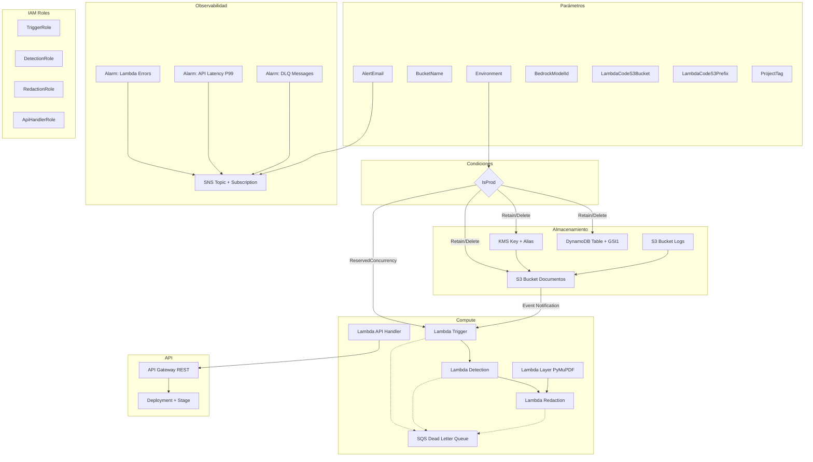
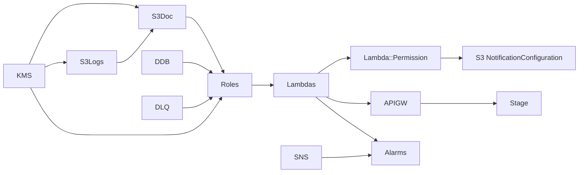

# Documento de Diseño — Template CloudFormation para Despliegue por Partner

## Overview

Este diseño describe la creación de un template AWS CloudFormation (YAML) autónomo que replica la infraestructura backend de DataMask AWS — actualmente definida en CDK TypeScript con 5 stacks (Storage, Compute, Api, Frontend, Observability) — en un único archivo desplegable sin herramientas de desarrollo. El objetivo es permitir que un partner técnico despliegue la aplicación en la cuenta AWS de un cliente usando exclusivamente la consola de CloudFormation o AWS CLI.

El entregable consta de tres artefactos principales:

1. **Template CloudFormation YAML** (`datamask-template.yaml`) — Archivo único que define todos los recursos backend: S3, KMS, DynamoDB, 4 Lambdas, Lambda Layer, API Gateway REST, SQS DLQ, SNS, y CloudWatch Alarms.
2. **Script de empaquetado** (`scripts/package-lambdas.sh`) — Shell script que crea los 5 archivos ZIP de las funciones Lambda y la capa PyMuPDF a partir del código fuente existente.
3. **Guía de despliegue** (`docs/guia-despliegue-partner.md`) — Documento en español con instrucciones paso a paso, prerequisitos, troubleshooting y diagrama de arquitectura.

### Decisiones Arquitectónicas Clave

| Decisión | Justificación |
|----------|---------------|
| Template único (no nested stacks) | Simplicidad para el partner — un solo archivo, sin dependencias externas ni buckets auxiliares para templates anidados |
| Lambda code desde S3 (no inline) | Las funciones tienen dependencias externas (boto3, PyMuPDF) que exceden el límite de 4096 bytes de `ZipFile` inline |
| Patrón `{LambdaCodeS3Bucket}/{LambdaCodeS3Prefix}{nombre}.zip` | Convención predecible — el partner sube 5 ZIPs a un bucket y proporciona bucket + prefijo como parámetros |
| Condiciones para prod/dev | `DeletionPolicy: Retain` en prod protege datos; `Delete` en dev facilita cleanup. `ReservedConcurrentExecutions` solo en prod |
| S3 Event Notification con `AWS::Lambda::Permission` + `NotificationConfiguration` | Evita dependencia circular: la Permission se crea primero, luego la configuración del bucket referencia la función |
| No incluir frontend (CloudFront/Amplify) | El partner despliega frontend separadamente o recibe un sitio estático pre-construido — reduce complejidad del template |
| Tags aplicados via función `!Sub` con pseudo-parámetros | Todos los recursos reciben tags consistentes sin repetición manual |

### Exclusiones Explícitas

- **Frontend** (CloudFront, Amplify, ACM Certificate) — no incluido en el template
- **IAM Identity Center** — requiere configuración manual post-deploy
- **VPC/Subnets** — Lambdas operan sin VPC (acceso a servicios AWS via endpoints públicos)
- **WAF** — opcional, no incluido en esta versión del template

## Architecture

### Diagrama de Recursos CloudFormation



### Estructura del Template YAML

El template sigue la estructura estándar de CloudFormation con las secciones:

```yaml
AWSTemplateFormatVersion: '2010-09-09'
Description: >-
  DataMask AWS v1.0 — Template para despliegue de infraestructura backend
  de ofuscación de datos sensibles en documentos PDF.

Parameters:      # 7 parámetros configurables
Conditions:      # IsProd, IsDev
Resources:       # ~35 recursos
Outputs:         # 5 exportaciones
```

### Orden de Creación y Dependencias



**Dependencia circular S3 ↔ Lambda — Solución:**

En CDK, `addEventNotification` crea un custom resource que maneja la dependencia circular automáticamente. En CloudFormation nativo se resuelve así:

1. Crear el bucket S3 SIN `NotificationConfiguration`
2. Crear las funciones Lambda
3. Crear `AWS::Lambda::Permission` (permite a S3 invocar la Lambda)
4. Usar un recurso `AWS::S3::BucketNotificationConfiguration` separado (no inline en el Bucket) — Nota: CloudFormation no tiene este tipo de recurso como separado, por lo que se usa `NotificationConfiguration` dentro del bucket con `DependsOn` explícito apuntando a la `Lambda::Permission`

La solución elegida: definir `NotificationConfiguration` dentro del bucket S3 con `DependsOn: TriggerLambdaPermission` para asegurar que la Permission existe antes de que CloudFormation intente configurar la notificación.

## Components and Interfaces

### 1. Template CloudFormation (`datamask-template.yaml`)

**Secciones detalladas:**

#### Parameters (7 parámetros)

| Parámetro | Tipo | Default | Validación | Propósito |
|-----------|------|---------|------------|-----------|
| `Environment` | String | `prod` | AllowedValues: dev, prod | Determina políticas de retención y concurrencia |
| `BucketName` | String | — | Regex `^[a-z0-9][a-z0-9.-]{1,61}[a-z0-9]$` | Nombre del bucket de documentos |
| `AlertEmail` | String | — | Regex email | Email para notificaciones SNS |
| `BedrockModelId` | String | `anthropic.claude-3-haiku-20240307-v1:0` | — | Modelo Bedrock para análisis PII |
| `LambdaCodeS3Bucket` | String | — | — | Bucket donde están los ZIPs de Lambda |
| `LambdaCodeS3Prefix` | String | `datamask/lambdas/` | — | Prefijo dentro del bucket de artefactos |
| `ProjectTag` | String | `DataMask` | — | Tag de proyecto para todos los recursos |

#### Conditions

```yaml
Conditions:
  IsProd: !Equals [!Ref Environment, 'prod']
  IsDev: !Equals [!Ref Environment, 'dev']
```

Uso de condiciones:
- `DeletionPolicy`: `Retain` si `IsProd`, `Delete` si `IsDev`
- `ReservedConcurrentExecutions`: Solo en `IsProd` (valor: 10 para Trigger, 5 para Detection, 5 para Redaction)
- `Versioning` en S3: Solo en `IsProd`
- `PointInTimeRecovery` en DynamoDB: Solo en `IsProd`

#### Resources (~35 recursos)

| # | Logical ID | Tipo AWS | Descripción |
|---|-----------|----------|-------------|
| 1 | `S3KmsKey` | `AWS::KMS::Key` | Clave CMK para cifrado SSE-KMS del bucket |
| 2 | `S3KmsKeyAlias` | `AWS::KMS::Alias` | Alias `datamask-{env}-s3-key` |
| 3 | `LogsBucket` | `AWS::S3::Bucket` | Bucket de logs, SSE-S3, lifecycle 90 días |
| 4 | `DocumentsBucket` | `AWS::S3::Bucket` | Bucket principal, SSE-KMS, event notification |
| 5 | `DocumentsTable` | `AWS::DynamoDB::Table` | Single-table con GSI1, PAY_PER_REQUEST |
| 6 | `DeadLetterQueue` | `AWS::SQS::Queue` | DLQ, retención 14 días, SSE-SQS |
| 7 | `AlertsTopic` | `AWS::SNS::Topic` | Topic para alarmas |
| 8 | `AlertsSubscription` | `AWS::SNS::Subscription` | Suscripción email |
| 9 | `PyMuPDFLayer` | `AWS::Lambda::LayerVersion` | Capa Python 3.12 con PyMuPDF |
| 10 | `TriggerRole` | `AWS::IAM::Role` | Role mínimo privilegio para Trigger |
| 11 | `DetectionRole` | `AWS::IAM::Role` | Role mínimo privilegio para Detection |
| 12 | `RedactionRole` | `AWS::IAM::Role` | Role mínimo privilegio para Redaction |
| 13 | `ApiHandlerRole` | `AWS::IAM::Role` | Role mínimo privilegio para API Handler |
| 14 | `TriggerFunction` | `AWS::Lambda::Function` | Lambda Trigger (S3 → Textract) |
| 15 | `DetectionFunction` | `AWS::Lambda::Function` | Lambda Detection (Comprehend + Bedrock) |
| 16 | `RedactionFunction` | `AWS::Lambda::Function` | Lambda Redaction (PyMuPDF) |
| 17 | `ApiHandlerFunction` | `AWS::Lambda::Function` | Lambda API Handler |
| 18 | `TriggerLambdaPermission` | `AWS::Lambda::Permission` | Permite S3 invocar Trigger |
| 19 | `RestApi` | `AWS::ApiGateway::RestApi` | API Gateway REST regional |
| 20-30 | Resources + Methods | `AWS::ApiGateway::Resource/Method` | Endpoints REST |
| 31 | `ApiDeployment` | `AWS::ApiGateway::Deployment` | Deployment del API |
| 32 | `ApiStage` | `AWS::ApiGateway::Stage` | Stage ({environment}) |
| 33 | `LambdaErrorsAlarm` (x4) | `AWS::CloudWatch::Alarm` | Errores > 5 en 5 min por función |
| 34 | `ApiLatencyAlarm` | `AWS::CloudWatch::Alarm` | P99 latency > 3s |
| 35 | `DlqMessagesAlarm` | `AWS::CloudWatch::Alarm` | Messages visible > 0 |
| 36 | `GatewayResponse403` | `AWS::ApiGateway::GatewayResponse` | Respuesta 403 genérica |
| 37 | `GatewayResponseUnauth` | `AWS::ApiGateway::GatewayResponse` | Unauthorized → 403 |

### 2. Script de Empaquetado (`scripts/package-lambdas.sh`)

**Responsabilidad**: Crear los 5 archivos ZIP listos para subir al bucket de artefactos S3.

**Interfaz CLI**:
```bash
./scripts/package-lambdas.sh [--output-dir ./dist] [--skip-layer]
```

**Artefactos generados**:

| Archivo | Contenido | Tamaño Estimado |
|---------|-----------|-----------------|
| `trigger.zip` | `lambdas/trigger/*.py` + `requirements.txt` instalados | ~5 MB |
| `detection.zip` | `lambdas/detection/*.py` + `requirements.txt` instalados | ~8 MB |
| `redaction.zip` | `lambdas/redaction/*.py` + `requirements.txt` instalados | ~3 MB |
| `api.zip` | `lambdas/api/*.py` + `requirements.txt` instalados | ~5 MB |
| `pymupdf-layer.zip` | `lambdas/layers/pymupdf/python/` (compilado para AL2023) | ~30 MB |

**Proceso por función**:
1. Crear directorio temporal
2. Copiar código fuente Python
3. Instalar dependencias de `requirements.txt` con `pip install -t .`
4. Crear ZIP excluyendo `__pycache__`, `.pytest_cache`, `tests/`
5. Mover ZIP al directorio de salida

**Proceso para capa PyMuPDF**:
1. Ejecutar `lambdas/layers/pymupdf/build.sh` (usa Docker para compilar contra AL2023)
2. Empaquetar el directorio `python/` en formato de Lambda Layer
3. Crear `pymupdf-layer.zip`

### 3. Guía de Despliegue (`docs/guia-despliegue-partner.md`)

**Estructura del documento**:

```
1. Introducción y Arquitectura
   - Descripción de DataMask AWS
   - Diagrama de arquitectura (Mermaid)
   - Servicios AWS utilizados

2. Prerrequisitos
   - Cuenta AWS con permisos de administrador
   - AWS CLI v2 instalado y configurado
   - Acceso al modelo Bedrock solicitado (Claude 3 Haiku)
   - Bucket S3 para artefactos Lambda (puede ser temporal)
   - Python 3.12 + Docker (para empaquetar Lambda Layer)

3. Preparación de Artefactos
   - Clonar repositorio o recibir paquete
   - Ejecutar script de empaquetado
   - Subir ZIPs al bucket de artefactos
   - Verificar que los 5 archivos existen

4. Despliegue del Stack
   - Comando completo con todos los parámetros
   - Alternativa: despliegue desde consola AWS
   - Tiempos de despliegue estimados (3-5 minutos)

5. Verificación Post-Despliegue
   - Consultar estado del stack
   - Obtener Outputs
   - Verificar funciones Lambda en consola
   - Test rápido de API Gateway

6. Configuración Adicional
   - Habilitar modelo Bedrock en la región
   - Configurar frontend (URL del API)
   - Confirmar suscripción SNS

7. Troubleshooting
   - Errores comunes y soluciones
   - Cómo consultar logs de CloudFormation
   - Rollback manual si es necesario

8. Actualización y Eliminación
   - Cómo actualizar el stack
   - Eliminación limpia (dev)
   - Consideraciones de retención (prod)

9. Costos Estimados
   - Desglose por servicio (Free Tier vs uso real)
```

## Data Models

### Referencia de Artefactos Lambda en S3

El template referencia los artefactos con la siguiente convención:

```yaml
# Patrón general
Code:
  S3Bucket: !Ref LambdaCodeS3Bucket
  S3Key: !Sub '${LambdaCodeS3Prefix}trigger.zip'
```

**Tabla de artefactos esperados por el partner:**

| Artefacto | S3 Key | Handler |
|-----------|--------|---------|
| Trigger | `{prefix}trigger.zip` | `handler.lambda_handler` |
| Detection | `{prefix}detection.zip` | `handler.lambda_handler` |
| Redaction | `{prefix}redaction.zip` | `handler.lambda_handler` |
| API Handler | `{prefix}api.zip` | `handler.handler` |
| PyMuPDF Layer | `{prefix}pymupdf-layer.zip` | N/A (layer) |

### Estructura de Tags en Recursos

Todos los recursos taggables incluyen:

```yaml
Tags:
  - Key: Project
    Value: !Ref ProjectTag
  - Key: Environment
    Value: !Ref Environment
  - Key: ManagedBy
    Value: CloudFormation
  - Key: Application
    Value: DataMask
  - Key: Stack
    Value: !Ref 'AWS::StackName'
```

### Mapa de Variables de Entorno por Lambda

| Variable | Trigger | Detection | Redaction | API Handler |
|----------|---------|-----------|-----------|-------------|
| `DOCUMENTS_BUCKET` | ✓ | ✓ | ✓ | ✓ |
| `DOCUMENTS_TABLE` | ✓ | ✓ | ✓ | ✓ |
| `ENVIRONMENT` | ✓ | ✓ | ✓ | ✓ |
| `DLQ_URL` | ✓ | ✓ | ✓ | — |
| `DETECTION_FUNCTION_NAME` | ✓ | — | — | — |
| `BEDROCK_MODEL_ID` | — | ✓ | — | — |
| `REDACTION_FUNCTION_NAME` | — | ✓ | — | — |

### Mapa de Permisos IAM por Role

| Acción | Trigger | Detection | Redaction | API Handler |
|--------|---------|-----------|-----------|-------------|
| `s3:GetObject` (originales/) | ✓ | — | ✓ | — |
| `s3:GetObject` (procesamiento/) | — | ✓ | ✓ | — |
| `s3:PutObject` (procesamiento/) | ✓ | ✓ | — | — |
| `s3:PutObject` (ofuscados/) | — | — | ✓ | — |
| `s3:PutObject` (errores/) | ✓ | — | — | — |
| `s3:PutObject` (originales/) | — | — | — | ✓ |
| `s3:GetObject` (ofuscados/) | — | — | — | ✓ |
| `s3:DeleteObject` (originales/) | ✓ | — | — | — |
| `dynamodb:GetItem` | ✓ | ✓ | ✓ | ✓ |
| `dynamodb:PutItem` | ✓ | — | — | ✓ |
| `dynamodb:UpdateItem` | ✓ | ✓ | ✓ | ✓ |
| `dynamodb:Query` | ✓ | ✓ | ✓ | ✓ |
| `textract:DetectDocumentText` | ✓ | — | — | — |
| `textract:StartDocumentTextDetection` | ✓ | — | — | — |
| `textract:GetDocumentTextDetection` | ✓ | — | — | — |
| `comprehend:DetectPiiEntities` | — | ✓ | — | — |
| `bedrock:InvokeModel` | — | ✓ | — | — |
| `lambda:InvokeFunction` (Detection) | ✓ | — | — | — |
| `lambda:InvokeFunction` (Redaction) | — | ✓ | — | — |
| `kms:Decrypt` | ✓ | ✓ | ✓ | ✓ |
| `kms:GenerateDataKey` | ✓ | ✓ | ✓ | ✓ |
| `sqs:SendMessage` (DLQ) | ✓ | ✓ | ✓ | — |
| `secretsmanager:GetSecretValue` | — | — | — | ✓ |
| `logs:CreateLogGroup` | ✓ | ✓ | ✓ | ✓ |
| `logs:CreateLogStream` | ✓ | ✓ | ✓ | ✓ |
| `logs:PutLogEvents` | ✓ | ✓ | ✓ | ✓ |

### Outputs del Stack

| Output | Value | Export Name |
|--------|-------|-------------|
| `ApiUrl` | URL del stage del API Gateway | `datamask-{env}-api-url` |
| `DocumentsBucketName` | Nombre del bucket | `datamask-{env}-documents-bucket` |
| `DocumentsTableName` | Nombre de la tabla DynamoDB | `datamask-{env}-documents-table` |
| `AlertsTopicArn` | ARN del topic SNS | `datamask-{env}-alerts-topic-arn` |
| `KmsKeyArn` | ARN de la clave KMS | `datamask-{env}-kms-key-arn` |

## Error Handling

### Errores de Validación del Template

| Error | Causa | Solución en Template |
|-------|-------|---------------------|
| Nombre de bucket inválido | Caracteres no permitidos | `AllowedPattern` con regex en Parameter |
| Email inválido | Formato incorrecto | `AllowedPattern` con regex de email |
| Región sin servicios requeridos | Textract/Comprehend no disponible | Regla custom con `AWS::CloudFormation::Rule` (nota: limitada — se documenta en guía) |
| Bucket de artefactos inexistente | Partner no creó el bucket | Error en creación de Lambda — documentado en troubleshooting |
| ZIP no encontrado en S3 | Path incorrecto o no subido | Error `S3Error` durante creación de Lambda |

### Estrategia de DeletionPolicy por Ambiente

```yaml
# Ejemplo aplicado con Condition
DocumentsBucket:
  Type: AWS::S3::Bucket
  DeletionPolicy: !If [IsProd, Retain, Delete]
  UpdateReplacePolicy: !If [IsProd, Retain, Delete]
```

**Recursos con DeletionPolicy condicional:**
- `DocumentsBucket` — Retain en prod (datos del cliente)
- `DocumentsTable` — Retain en prod (estado de documentos)
- `S3KmsKey` — Retain en prod (necesaria para descifrar datos existentes)
- `LogsBucket` — Delete siempre (logs de acceso, regenerables)
- Resto de recursos — Delete siempre (funciones Lambda, roles, API Gateway son recreables)

### Rollback Automático

CloudFormation ejecuta rollback automático si cualquier recurso falla durante la creación. El template está diseñado para que:

1. Los recursos sin estado (roles IAM, Lambdas, API Gateway) se eliminan limpiamente
2. Los buckets S3 recién creados están vacíos → pueden eliminarse en rollback
3. La tabla DynamoDB nueva está vacía → puede eliminarse en rollback

### Errores Comunes Post-Deploy

| Síntoma | Causa Probable | Acción |
|---------|----------------|--------|
| Lambda timeout al procesar PDF | PDF > 15 páginas con Textract síncrono | Verificar que el Trigger usa async para docs grandes |
| 403 en API Gateway | CORS no configurado en cliente | Verificar AllowOrigin en frontend |
| Bedrock InvokeModel error | Modelo no habilitado en la región | Solicitar acceso en Bedrock console |
| DLQ acumula mensajes | Fallos recurrentes en pipeline | Revisar CloudWatch Logs de la función afectada |

## Testing Strategy

### Enfoque de Testing (sin Property-Based Testing)

**Justificación de exclusión de PBT**: Esta feature produce artefactos de Infrastructure as Code (CloudFormation YAML), scripts de shell, y documentación. No hay funciones con inputs/outputs variables que se beneficien de testing basado en propiedades. En su lugar, se aplican:

1. **Validación de template** — `aws cloudformation validate-template`
2. **Linting de CloudFormation** — `cfn-lint` para detectar errores de sintaxis y mejores prácticas
3. **Tests de snapshot** — Verificar que el template generado no cambia inesperadamente
4. **Tests de integración** — Despliegue real en cuenta de desarrollo

### Unit Tests (Template Validation)

| Test | Herramienta | Qué Verifica |
|------|-------------|--------------|
| Sintaxis YAML válida | `yamllint` | Formato correcto, indentación |
| Template válido | `aws cloudformation validate-template` | Estructura CloudFormation correcta |
| Mejores prácticas | `cfn-lint` | Sin wildcards en IAM, tags presentes, tipos correctos |
| Parámetros completos | Script Python con `pyyaml` | Los 7 parámetros tienen Description, Type, y validación |
| Outputs presentes | Script Python | Los 5 outputs esperados existen con Export.Name correcto |
| Condiciones funcionan | Script Python | `IsProd` y `IsDev` referenciados donde se espera |

### Tests de Integración

| Escenario | Método | Criterio de Éxito |
|-----------|--------|-------------------|
| Deploy en dev | `aws cloudformation create-stack` en cuenta dev | Stack en estado `CREATE_COMPLETE` |
| Parámetros mínimos | Solo parámetros obligatorios | Stack se crea con defaults correctos |
| Delete stack dev | `aws cloudformation delete-stack` | Todos los recursos eliminados |
| Upload + procesamiento | Subir PDF al bucket tras deploy | Documento procesado, estado COMPLETED en DynamoDB |
| API Gateway responde | `curl` al endpoint | HTTP 200 con respuesta JSON |

### Tests del Script de Empaquetado

| Test | Qué Verifica |
|------|--------------|
| Genera 5 archivos ZIP | `ls dist/*.zip | wc -l` == 5 |
| ZIPs contienen handler | `unzip -l trigger.zip | grep handler.py` |
| Dependencias instaladas | `unzip -l detection.zip | grep boto3` |
| No incluye tests | `unzip -l trigger.zip | grep -c tests/` == 0 |
| No incluye __pycache__ | `unzip -l trigger.zip | grep -c __pycache__` == 0 |
| Layer tiene estructura correcta | `unzip -l pymupdf-layer.zip | grep python/` |

### Checklist de Validación Manual (Pre-Release)

- [ ] Template pasa `cfn-lint` sin errores
- [ ] Template pasa `aws cloudformation validate-template`
- [ ] Deploy exitoso en cuenta de desarrollo (región us-east-1)
- [ ] Deploy exitoso en cuenta de desarrollo (región eu-west-1)
- [ ] Script de empaquetado funciona en macOS y Linux
- [ ] Guía de despliegue revisada por persona no-técnica
- [ ] Todos los comandos de la guía probados paso a paso
- [ ] Eliminación limpia del stack en dev
- [ ] Pipeline de procesamiento funcional post-deploy
