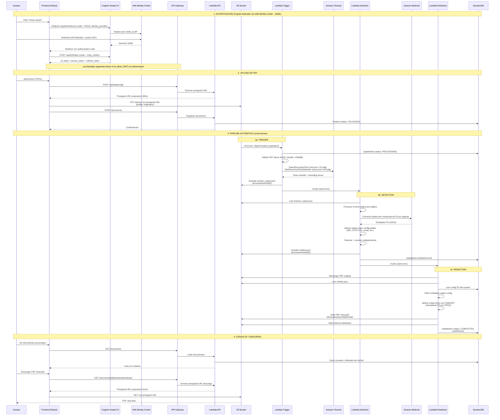

# Flujo de la Aplicación — DataMask AWS

## Resumen

DataMask AWS procesa documentos PDF para detectar y ofuscar datos personales sensibles (PII). El flujo es completamente serverless y event-driven: el usuario sube un PDF, y el sistema lo procesa automáticamente a través de un pipeline de 3 Lambdas encadenadas.

---

## Diagrama de Flujo Completo



---

## Detalle de Cada Etapa

### 1. Autenticación

La autenticación se realiza con **Amazon Cognito** (User Pool) como Service
Provider SAML, **federado con AWS IAM Identity Center** como IdP. El usuario
inicia sesión en la Hosted UI de Cognito, que redirige a Identity Center; si la
organización federa con Active Directory u otro IdP externo, ese mecanismo se
usa de forma transparente. El **id token (JWT)** autoriza el API mediante un
**Cognito User Pools authorizer** en API Gateway.

| Componente | Detalle |
|-----------|---------|
| Proveedor de identidad de la app | Amazon Cognito User Pool |
| IdP federado | AWS IAM Identity Center (SAML 2.0) |
| Federación | Soporta AD corporativo u otro IdP externo configurado en Identity Center |
| Flujo | OAuth2 Authorization Code + PKCE (cliente público, sin secret) |
| Autorización del API | API Gateway + Cognito User Pools authorizer (valida el JWT) |
| Tokens | id/access token (~60 min), refresh token (~30 días) |
| Renovación | Automática con el refresh token, 5 min antes de expirar |
| Persistencia | `localStorage` (sobrevive al cierre de la pestaña) |
| Identidad backend | Derivada del claim `email` del JWT (ej: eduvilas@org.com → eduvilas) |

> Detalle completo en [`docs/autenticacion.md`](autenticacion.md).

### 2. Upload

| Componente | Detalle |
|-----------|---------|
| Validación frontend | Extensión .pdf, MIME application/pdf, <50MB, máx 30 archivos |
| Presigned URL | Expiración 300s, método PUT, prefijo `originales/` |
| Retry | 3 intentos con backoff exponencial (1s, 2s, 4s) |
| Destino S3 | `s3://{bucket}/originales/{userId}/{filename}` (estructura plana) |
| Estado DynamoDB | `UPLOADED` |

### 3a. Trigger (Lambda)

| Componente | Detalle |
|-----------|---------|
| Evento | `s3:ObjectCreated:*` en prefijo `originales/` |
| Validación | Firma `%PDF`, tamaño <500MB |
| Textract síncrono | PDFs < 15 páginas (DetectDocumentText) |
| Textract asíncrono | PDFs ≥ 15 páginas (StartDocumentTextDetection + polling 5s) |
| Timeout | 300s |
| Salida | `procesamiento/{docId}/textract_output.json` |
| Estado DynamoDB | `PROCESSING` → error: `FAILED` |
| Errores | Archivo movido a `errores/`, estado FAILED en DDB, mensaje a DLQ |

### 3b. Detection (Lambda)

| Componente | Detalle |
|-----------|---------|
| Estrategia | Detección **página por página** (cada página se analiza por separado) |
| Bedrock (IA) | API Converse, modelo configurable, timeout 30s, texto truncado a 10000 chars/página |
| Localización | El texto de cada entidad de IA se ubica en el documento (no se confía en el offset del modelo); las alucinaciones se descartan |
| Regex configurables | Reglas `{type, pattern, enabled}` editables desde la UI (DNI, CUIT/CUIL, email, teléfonos, tarjetas, cuentas, etc.) |
| Fusión | Resolución de solapamientos por cobertura → confianza → prioridad de motor (regex > IA) |
| Salida | `procesamiento/{docId}/entities.json` |
| Fallback | Si Bedrock falla, continúa solo con Regex |

> El prompt, el modelo, la temperatura y las reglas regex provienen
> **exclusivamente de la Configuración** del usuario (DynamoDB). No hay prompt
> ni reglas hardcodeadas en el pipeline. El campo **`detectionMethod`**
> (`ai` | `regex` | `both`) define qué motores se aplican. Ver
> [`algoritmos-ofuscacion.md`](algoritmos-ofuscacion.md).

### 3c. Redaction (Lambda)

| Componente | Detalle |
|-----------|---------|
| PyMuPDF | Redacción visual con color de fondo por tipo de PII |
| Etiquetas | `[NOMBRE]`, `[EMAIL]`, `[DNI]`, `[CUIT_CUIL]`, etc. |
| Redacción | Solo ofusca entidades detectadas (regex configurable + IA) |
| Salida PDF | `ofuscados/{userId}/{docId}/{stem}_ofuscado.pdf` |
| Salida MD | `ofuscados/{userId}/{docId}/{stem}_informe.md` |
| Verificación Macie | Opcional (config `macieVerification`): tras confirmar el PDF ofuscado en S3, crea un classification job ONE_TIME de Macie acotado al prefijo del documento. Asíncrono y resiliente; estado en `macie_status` (`DISABLED`/`REQUESTED`/`UNAVAILABLE`). No bloquea el pipeline |
| Estado final | `COMPLETED` con estadísticas (entitiesFound, entitiesByType, processingTimeMs, macieStatus) |
| Sin entidades | Si no se detectan entidades, no genera archivo ofuscado |

### 4. Consulta y Descarga

| Endpoint | Método | Descripción |
|----------|--------|-------------|
| `/documents` | GET | Lista documentos paginados, ordenados por fecha desc |
| `/documents/{id}` | GET | Detalle de un documento con estadísticas |
| `/documents/{id}/download/pdf` | GET | Presigned URL para PDF ofuscado (5min) |
| `/documents/{id}/download/markdown` | GET | Presigned URL para informe MD (5min) |
| `/config/detection` | GET | Configuración de detección (método, verificación Macie, modelo, temperatura, prompt, regex, ignorar) |
| `/config/detection` | PUT | Actualizar configuración de detección |
| `/config/models` | GET | Lista de modelos de Bedrock disponibles |

---

## Manejo de Errores

### Categorías de error

| Categoría | Descripción | Acción |
|-----------|-------------|--------|
| `INVALID_PDF` | PDF corrupto o no es un PDF válido | Mover a `errores/`, estado FAILED |
| `FILE_TOO_LARGE` | Excede 500MB | Mover a `errores/`, estado FAILED |
| `PASSWORD_PROTECTED` | PDF protegido con contraseña | Estado FAILED |
| `TEXTRACT_ERROR` | Error al extraer texto | Reintentar 1x, luego FAILED + DLQ |
| `TEXTRACT_TIMEOUT` | Timeout de Textract (>300s) | Estado FAILED + DLQ |
| `DETECTION_ERROR` | Error en detección PII | Estado FAILED + DLQ |
| `REDACTION_ERROR` | Error al aplicar redacción | Estado FAILED + DLQ |

### Dead Letter Queue (DLQ)

Todos los errores no manejados se envían a la SQS Dead Letter Queue con:
- Retención: 14 días
- Alarma CloudWatch: mensajes > 0 → notificación SNS
- Cada mensaje incluye: función origen, error, timestamp, documentId

### Alarmas CloudWatch

| Alarma | Condición | Acción |
|--------|-----------|--------|
| Lambda Errors | > 5 errores en 5 min (por función) | Email SNS |
| API Latency P99 | > 3 segundos en 5 min | Email SNS |
| DLQ Messages | > 0 mensajes visibles | Email SNS |

---

## Estructura de Datos en DynamoDB

### Single-Table Design

| Access Pattern | PK | SK |
|---------------|----|----|
| Documento por ID | `USER#{userId}` | `DOC#{docId}` |
| Documentos de un usuario | `GSI1PK: USER#{userId}` | `GSI1SK: STATUS#{status}#TIMESTAMP#{ts}` |
| Configuración de detección | `USER#{userId}` | `CONFIG#DETECTION` |

### GSI1

| Access Pattern | GSI1PK | GSI1SK |
|---------------|--------|--------|
| Documentos por estado | `STATUS#{status}` | `{timestamp}` |

---

## Estructura S3

```
s3://datamask-{env}-documents-{accountId}/
├── originales/                    # PDFs subidos por el usuario
│   └── {userId}/
│       └── {filename}.pdf         # estructura plana (sin UUID intermedio)
├── procesamiento/                 # Artefactos intermedios
│   └── {userId}/{docId}/
│       ├── textract_output.json   # Texto extraído por Textract
│       └── entities.json          # Entidades PII detectadas
├── ofuscados/                     # Documentos finales
│   └── {userId}/{docId}/
│       ├── {stem}_ofuscado.pdf
│       └── {stem}_informe.md
└── errores/                       # PDFs inválidos (TTL: 30 días)
    └── {userId}/{docId}/
        └── {filename}.pdf
```

---

## Seguridad

| Aspecto | Implementación |
|---------|---------------|
| Cifrado at-rest | SSE-KMS con rotación automática de clave |
| Cifrado in-transit | TLS 1.2+ en API Gateway y CloudFront; bucket policy deny si no-TLS |
| Acceso S3 | Block Public Access en todos los buckets |
| IAM | Mínimo privilegio por función Lambda (sin wildcards en acciones) |
| Autenticación | Amazon Cognito federado con IAM Identity Center (SAML); JWT en el API |
| Secrets | AWS Secrets Manager (nunca hardcodeados) |
| Respuestas de error | HTTP 403 genérico (no revelar existencia de recursos) |
| Logs | No se registran datos PII en CloudWatch |
| DLQ | Cifrado SQS Managed SSE |
